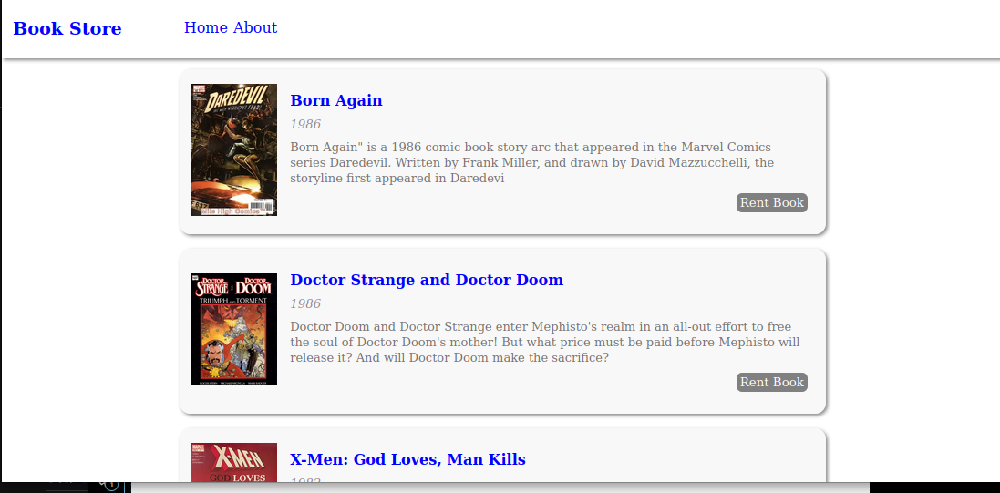
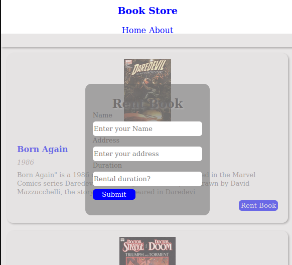

## Book Store

### Desktop

### Mobile

## Built With

- HTML5, JavaScript, and CSS

## Getting Started

To get this project running on your local computer, You will need the following extension(s) and applications:

- Code Editor, [VSCode](https://code.visualstudio.com/) preferred,
- [Live Server](https://marketplace.visualstudio.com/items?itemName=ritwickdey.LiveServer),
- A web browser [Chrome](https://www.google.com/chrome/?brand=YTUH&gclid=Cj0KCQiAn4SeBhCwARIsANeF9DKaZq0l0X7Hht0nGx-tqut0skaI5FBgHddaBC1ccKZZDn8LvsEjxB0aAnBPEALw_wcB&gclsrc=aw.ds) preferred

## How it works?
The Book store application is a simple implementation of a books rental shop built with HTML,CSS and Vanilla JavaScript.
The application comes pre loaded with minimal books data and are subsequently display on the home screen for user interactivity.

The activities on this app includes but not limited to Renting a book(2 Books per username), supplying user minimal bio data and verification of the supplied data with local data, storage of these generated information o the local machine, minimal feedback through toast like implemetations and modals.

## Author(s)

👤 **Makoji David**

- GitHub: [@aceDavon](https://github.com/aceDavon)
- Twitter: [@sharkleshevons](https://twitter.com/sharkleshevon)
- LinkedIn: [Makoji David](https://www.linkedin.com/in/david-makoji-b6090971/)

## Acknowledgments

- Google Books collections(Popular books in the 80s)